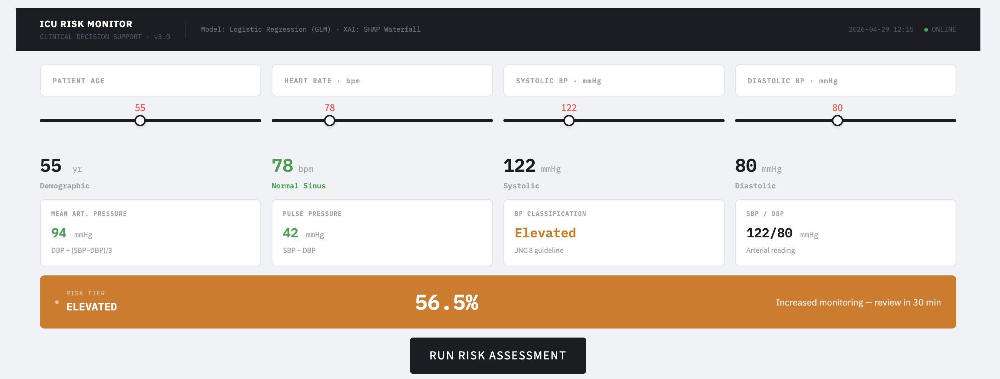
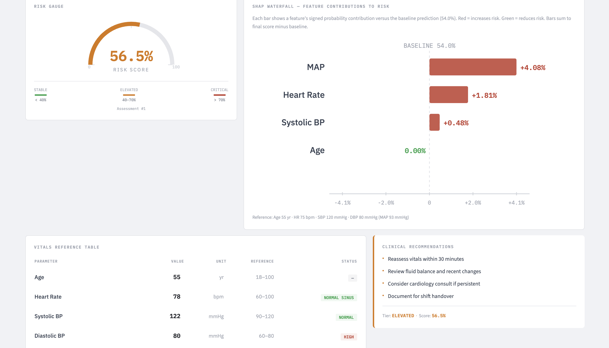

# ICU Risk Prediction: Interpretable Clinical Decision Support System

## Overview
This project focuses on building a clinical decision support system to predict in-hospital mortality risk for patients admitted to Intensive Care Units (ICUs). The system is designed with a strong emphasis on interpretability, ensuring that predictions are not only accurate but also explainable.
In clinical environments, understanding why a model makes a prediction is as important as the prediction itself. This project addresses that need by combining a transparent modeling approach with techniques that allow detailed analysis of feature contributions. The overall goal is to support informed decision-making rather than relying on opaque, black-box systems.

## Dataset
The model is trained on the ICU Patient Outcome Prediction, a publicly available dataset hosted on Kaggle.
This dataset contains electronic health record (EHR) data collected from ICU patients and is designed for predicting in-hospital mortality.
It consists of:
- 3,600 patient records  
- 120 initial features (reduced to 68 after preprocessing)
The features include:
- Demographic information such as age and gender  
- Clinical severity scores including SAPS-I and SOFA  
- Physiological and laboratory measurements such as heart rate, pH, glucose, and blood-related parameters  
- ICU admission indicators (e.g., CCU, CSRU, SICU)
  
The target variable represents in-hospital mortality and exhibits class imbalance, with significantly fewer mortality cases compared to survivals.

## Data Preprocessing
The dataset required extensive preprocessing to ensure reliability and consistency.
- Columns with more than 70% missing values were removed to reduce noise and improve model stability  
- Remaining missing values were imputed using the median, preserving the distribution of clinical variables  
- The dataset was split into training and testing sets using an 80–20 ratio

After preprocessing, the feature space was reduced from 120 to 68 meaningful variables.

## Modeling Approach
The primary model used in this project is Logistic Regression. This choice was made to maintain interpretability, as each feature directly contributes to the final prediction through its coefficient.

Two configurations were evaluated:
- Standard Logistic Regression  
- Logistic Regression with class balancing  

The imbalanced nature of the dataset required special attention. By applying class weighting, the model became more sensitive to minority class cases (patients at risk of mortality), which is critical in medical applications.

## Model Performance

The model was evaluated using accuracy, precision, recall, and F1-score, with particular focus on the mortality class due to class imbalance.

| Model                          | Accuracy | F1-score (Mortality) | Recall (Mortality) |
|--------------------------------|----------|----------------------|--------------------|
| Standard Logistic Regression   | 0.87     | 0.35                 | 0.26               |
| Balanced Logistic Regression   | 0.77     | 0.48                 | 0.81               |
| Threshold Tuning (0.3)         | 0.65     | 0.41                 | 0.92               |
| XGBoost                        | 0.86     | 0.41                 | 0.37               |

### Key Observation
The results highlight a critical trade-off between accuracy and clinical usefulness. Models with higher accuracy tend to miss high-risk patients, whereas models optimized for recall and F1-score are more effective in identifying critical cases. For this reason, the balanced Logistic Regression model was selected as the final approach.

## Deployment
The trained model is saved using joblib and integrated into a Streamlit application.
The Streamlit interface allows users to:
- Input patient data manually  
- Generate real-time mortality risk predictions  
- Analyze how different clinical variables influence the outcome
  
The application provides an interactive environment for exploring model behavior and understanding patient risk profiles.

## Use Case
This system demonstrates how interpretable machine learning can be applied in healthcare to assist in risk assessment. It is particularly useful in scenarios where understanding the reasoning behind predictions is essential.

## The project can serve as a foundation for:
- Clinical decision support tools  
- Healthcare analytics systems  
- Research in explainable AI for medicine

## Disclaimer
This project is intended for research and educational purposes only. It is not designed for clinical deployment and should not be used as a substitute for professional medical judgment.
